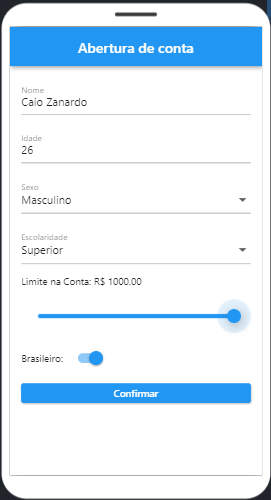
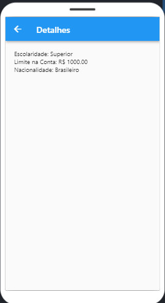

# appFormulario3telas

- Preencher os campos; 

- Ao clicar no botão "confirmar" alguns dados apareceram na 2ª tela;

- Após clicar no botão "Mais Detalher" os demais dados apareceram na 3ª tela;

